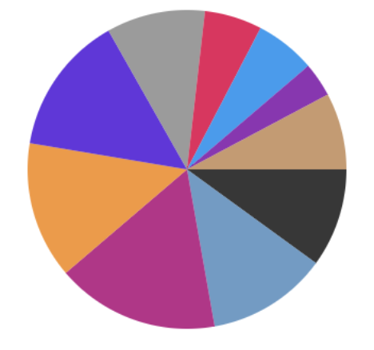

# gwc-data-visualization-workshop

For this workshop, we are going to introduce to you the basics of data visualizations using processing.js. We will cover the basic chart types and how to translate quantitative data into graphics and animation.

## Getting Started
Once you download this project to your computer, type in the following command in your Terminal:
```bash
python -m SimpleHTTPServer 8080
```

Next, visit `localhost:8080/getting-started` in your web browser. You should see an animation based on [`frameCount`](https://processing.org/reference/frameCount.html) in Processing. We will reference `frameCount` in the basic chart types and animation of the charts.

## Basic Charts

### Bar Chart


Double check if you are loading `bar_chart.pde` in `basic-charts/index.html` line#6. So the "src" attribute should look like:
```html
<script type="text/processing" src="bar_chart.pde" data-processing-target="mycanvas"></script>
```

Make sure python SimpleHTTPServer is still running. Then, visit `localhost:8080/basic-charts/index.html` in your web browser.

### Column Chart


Change `src` to `column_chart.pde`.

### Pie Chart


Change `src` to `pie_chart.pde`.
